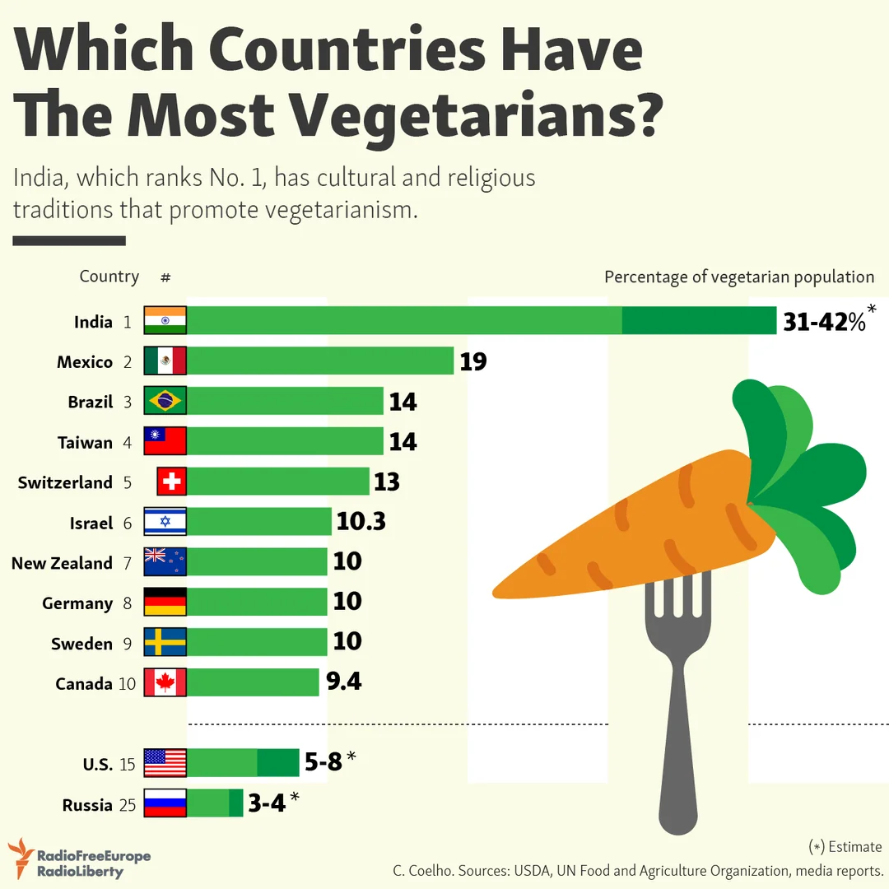

# 世界各地的素食文化

素食并不是一种现代潮流，而是在人类文明中延续千年的生活方式。不同的文化、信仰与地域习惯，形成了各具特色的素食传统。

## 中国

中国的素食文化可以追溯到两千多年前。早期源于宗教信仰，尤其与佛教、道教密切相关。佛教传入中国后，倡导“戒杀放生”，形成了“吃斋”的习惯。

“斋”不仅仅是饮食禁忌，更是一种修心方式。传统佛教素食讲究“无荤无五辛”，认为这些辛辣食材会扰乱心神，不利于修行。这种饮食又被称作“纯净素”。

寺庙素食以豆腐、豆干、面筋、菌菇、蔬菜为主要食材，注重原味与清淡，讲究“色香味形”的和谐。许多民间名菜如“素烤鸭”“罗汉斋”“素狮子头”等，都是在模仿荤菜的口感与形态中发展而来。

现代社会中，“轻素食”逐渐流行，主打少油少盐、均衡营养、植物蛋白。它脱离宗教约束，更强调健康与环保理念。例如沙拉碗、素汉堡、豆浆燕麦奶等新式素食，在中国城市中日渐普及。

## 印度

印度是世界上素食人口最多的国家，约有三分之一的印度人坚持素食。

这与印度的宗教传统密切相关 —— 印度教、佛教、耆那教都奉行“Ahimsa”（非暴力）原则，主张尊重一切生命，不杀生害命。

印度的素食体系非常发达，食材丰富，味道浓烈，讲究香料的层次感与营养均衡。常见的素食包括：

- **Dal（豆汤）**：以扁豆或鹰嘴豆为主的蛋白质来源；
- **Chapati / Roti（全麦薄饼）**：主食之一，搭配咖喱；
- **Paneer（印度奶酪）**：蛋白质丰富，是蛋奶素者的重要食材；
- **Masala、Curry、Thali**：各种香料混合的咖喱或套餐。

值得注意的是，印度不同地区、种姓和宗教对素食的定义差异很大。有些印度人完全纯素（不含奶、蜂蜜），而有些则属于**奶素（Lacto-vegetarian）**，可食用牛奶制品。

印度素食不仅是一种饮食习惯，更是一种哲学生活方式：**吃饭即修行，食物即慈悲**。

## 地中海饮食

**地中海饮食（Mediterranean Diet）**常被认为是最接近素食、又兼顾全面营养的一种饮食模式。它起源于希腊、意大利、西班牙等地中海沿岸国家，以**橄榄油、全谷物、豆类、蔬果、坚果**为主，适量摄入奶制品与海鱼。

这种饮食方式强调“**天然、适量、多样、慢食**”，被联合国教科文组织列为“人类非物质文化遗产”。大量研究表明，地中海饮食能有效降低心血管疾病风险、延缓衰老、促进心理健康。

对于素食者而言，地中海饮食的价值在于：

- 提供丰富的不饱和脂肪酸（来自橄榄油、坚果）；
- 高纤维、高抗氧化的植物性食物比例；
- 灵活可调整，可轻松转为全素（Vegan Mediterranean Diet）。

## 小结

无论是东方寺庙的清斋，印度的香料豆汤，还是地中海的橄榄与谷物，人类几千年来对“素食”的理解都不尽相同，却指向了相同的愿景 —— **敬畏生命，追求健康，与自然共处。**
