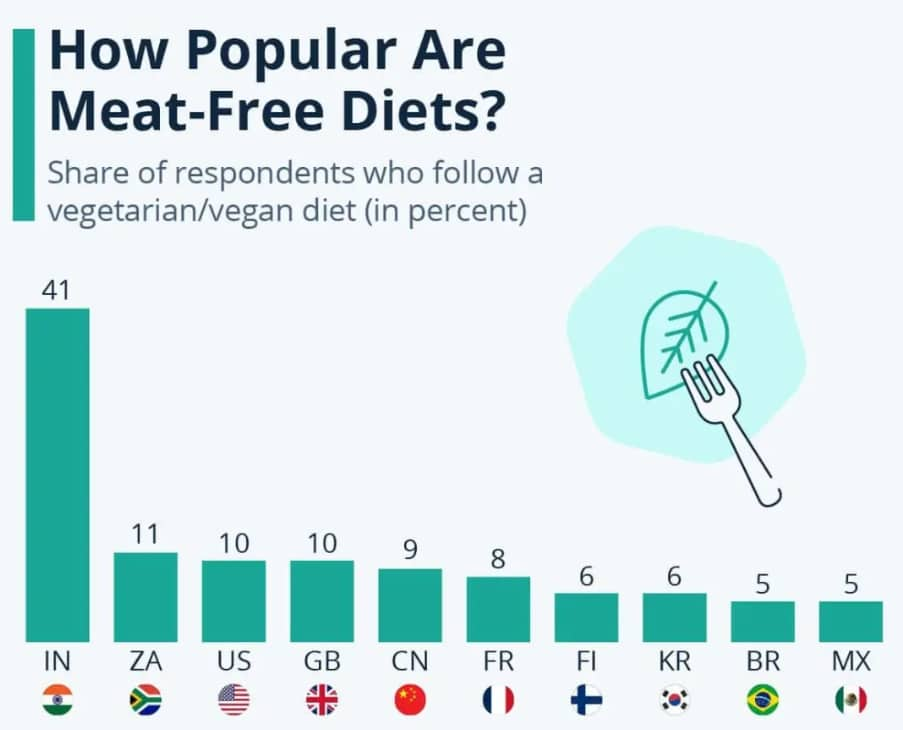

# 世界各地的素食文化

素食并不是一种现代潮流，而是在人类文明中延续千年的生活方式。不同的文化、信仰与地域习惯，形成了各具特色的素食传统。

## 素食人群分布情况

在介绍世界各地的素食文化之前，我们先来看看全球范围内素食人群的分布情况，哪些国家或地区的素食者比例较高？

我查阅了好多资料，也许是这类数据太难统计了，所以没有找到确切的数据。原因可能是大家对“素食”的理解不同，那么多素食类型，怎么样才算素食呢？只有纯素才算吗？需要每天吃素才算吗？总之，由于统计口径不同，统计数据也有很大差异。

下面是全球统计数据库 Statista 的调查数据，他们在 2023 年至 2024 年期间对不同国家 2,000-10,000 名年龄在 18-64 岁之间的受访者进行“无肉饮食”（Meat-Free）调查。

前十名的国家分别是印度、南非、美国、英国、中国、法国、芬兰、韩国、巴西、墨西哥。

- 第一名是印度，比例达到 41%，明显高于 2 至 9 名。由于受印度教、耆那教、佛教的禁肉传统影响，印度是全球素食比例最高的国家，约有 30%-42% 的人口实践某种形式的素食。
- 欧美国家的素食文化与“动物福利（animal welfare）”和“气候行动”紧密相关，特别是年轻一代中，“Vegan”、“Plant-based”、“Cruelty-free” 等概念已经形成消费文化，素食人群稳定增长。
- 我们中国位于第五名，为 9%。这么高的比例很让人感到意外，因为我们在日常生活中并不容易遇到素食者（我们预估国内的素食人群应该在千万级别，不超过 5%）。如果单独统计台湾地区的话，素食比例约为 14%。
- 韩国“无肉饮食”比例高的原因，是传统与潮流叠加的结果，而非完全出于宗教或伦理。它代表着一种“融合东方哲思与现代健康”的新型素食文化。
- Statista 的数据往往高于现实中的严格素食比例，这与其调查方式有关，调查者可能认为偶尔不吃肉、或者不吃红肉（但吃鸡肉、鱼肉等）就属于 Meat-Free Diet，但实际上并不等同于素食者。

除去统计口径的影响，宗教传统、健康意识、经济因素是影响素食人群分布的三大因素。

| 因素类别 |               主要国家               |       影响特点       |
| :------: | :----------------------------------: | :------------------: |
| 宗教传统 |    印度、中国、韩国、南非部分地区    | 持续、稳定的素食文化 |
| 健康意识 | 英国、法国、芬兰、美国、巴西、墨西哥 | 与肥胖、环保议题相关 |
| 经济因素 |      南非、墨西哥、中国部分人群      |   肉类消费并非常态   |
| 统计口径 |    全球通用（Meat-Free ≠ Vegan）     |     导致比例虚高     |

## 中国

中国的素食文化可以追溯到两千多年前。早期源于宗教信仰，尤其与佛教、道教密切相关。佛教传入中国后，倡导“戒杀放生”，形成了“吃斋”的习惯。“斋”不仅仅是饮食禁忌，更是一种修心方式。传统佛教素食讲究“无荤无五辛”，认为这些辛辣食材会扰乱心神，不利于修行。这种饮食又被称作“纯净素”。

从宋朝开始，出现了专业化的素食，在《东京梦华录》和《梦梁录》等书籍中多有记载 —— 北宋首都汴梁已经有了专做素食的菜馆，南宋首都临安流行的素食有上百种，能当相声《报菜名》说。

古代文人墨客崇尚素食主义多受儒、释、道多元文化影响，儒家的仁爱、孝道，佛教不杀生，要有慈悲之心，道家的清心寡欲与淡泊自然，三者在倡导清淡饮食的问题上殊途同归，使得文人对素食有一种天然的亲近感。随着国学文化兴起，中国现代的素食文化也开始呈现出类似的清雅的感觉，形成了我们独特的素食文化。

传统的素食，如寺庙素食，常以豆腐、豆干、面筋、菌菇、蔬菜为主要食材，注重原味与清淡，讲究“色香味形”的和谐。许多民间名菜如“素烤鸭”、“罗汉斋”、“素狮子头”等，都是在模仿荤菜的口感与形态中发展而来。

现代社会中，“轻素食”逐渐流行，主打少油少盐、均衡营养、植物蛋白。它脱离宗教约束，更强调健康与环保理念。例如沙拉碗、素汉堡、豆浆燕麦奶等新式素食，在中国城市中日渐普及。

## 韩国

韩国自古信奉佛教，尤其在高丽、朝鲜时期，僧侣饮食严格遵循五辛禁戒（不食葱、蒜、韭、薤、兴渠），逐渐形成“寺庙料理”文化 —— 强调自然、少盐、无刺激、尊重食材原味。韩国文化部还将“寺庙料理”列为国家非物质文化遗产之一，可见其文化地位之高。

相信有不少朋友看过“正宽法师（Jeong Kwan）”的视频，她也因做客 Netflix《主厨的餐桌》（Chef’s Table）而成为韩国乃至国际上素食料理的象征人物。她不仅佛法造诣颇深，还是一位隐世高厨，她做的素斋胜过肉类和海鲜，被《纽约时报》评价为“超越米其林三星的美味”。

进入 2010 年代后，韩国年轻人开始重视健康、身材管理、环境议题。“비건（Vegan）”一词逐渐进入主流媒体，形成以健康、美容、环保为核心的新消费趋势。首尔、釜山等城市涌现出大量 Vegan 餐厅、Vegan 化妆品品牌、Vegan 烘焙店。2022 年统计显示，韩国“素食人口”已超过 250 万人（约占全国人口的 5% 左右），其中包含“弹性素”群体。韩国甚至出现了专门的 Vegan 便利店、Vegan 节日、Vegan 认证体系（韩国 Vegan 认证机构 KVCS）。

## 印度

印度是世界上素食人口最多的国家，约有三分之一的印度人坚持素食。这与印度的宗教传统密切相关 —— 印度教、佛教、耆那教都奉行“Ahimsa”（非暴力）原则，主张尊重一切生命，不杀生害命。

印度的素食体系非常发达，食材丰富，味道浓烈，讲究香料的层次感与营养均衡。常见的素食包括：

- **Dal（豆汤）**：以扁豆或鹰嘴豆为主的蛋白质来源；
- **Chapati / Roti（全麦薄饼）**：主食之一，搭配咖喱；
- **Paneer（印度奶酪）**：蛋白质丰富，是蛋奶素者的重要食材；
- **Masala、Curry、Thali**：各种香料混合的咖喱或套餐。

值得注意的是，印度不同地区、种姓和宗教对素食的定义差异很大。有些印度人完全纯素（不含奶、蜂蜜），而有些则属于奶素（Lacto-vegetarian），可食用牛奶制品。

印度素食不仅是一种饮食习惯，更是一种哲学生活方式：**吃饭即修行，食物即慈悲**。

## 地中海饮食

**地中海饮食**（Mediterranean Diet）常被认为是最接近素食、又兼顾全面营养的一种饮食模式。它起源于希腊、意大利、西班牙等地中海沿岸国家，以**橄榄油、全谷物、豆类、蔬果、坚果**为主，适量摄入奶制品与海鱼。

这种饮食方式强调“**天然、适量、多样、慢食**”，被联合国教科文组织列为“人类非物质文化遗产”。大量研究表明，地中海饮食能有效降低心血管疾病风险、延缓衰老、促进心理健康。

对于素食者而言，地中海饮食的价值在于：

- 提供丰富的不饱和脂肪酸（来自橄榄油、坚果）；
- 高纤维、高抗氧化的植物性食物比例；
- 灵活可调整，可轻松转为全素（Vegan Mediterranean Diet）。

## 小结

无论是东方寺庙的清斋，印度的香料豆汤，还是地中海的橄榄与谷物，人类几千年来对“素食”的理解都不尽相同，却指向了相同的愿景 —— **敬畏生命，追求健康，与自然共处。**
