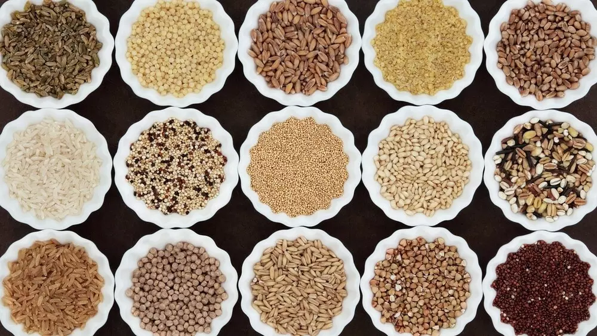
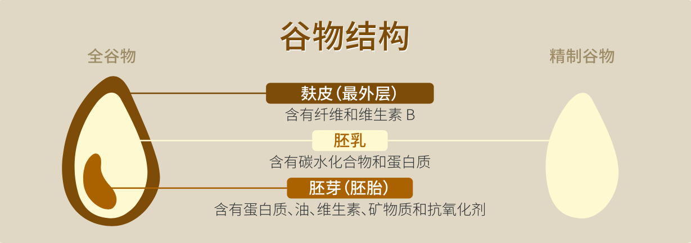
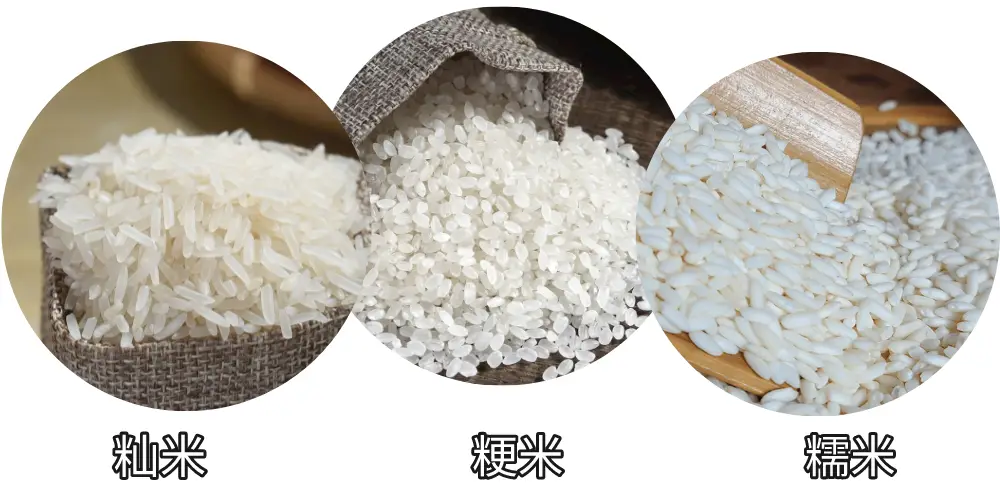
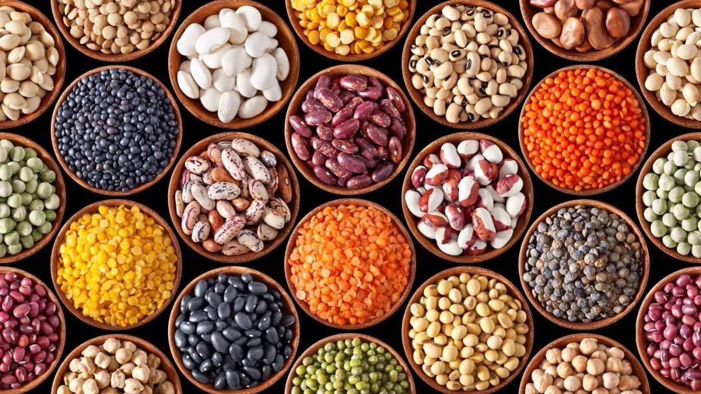

# 谷物与豆类

“民以食为天，食以谷为先”，谷物在人类文明和发展中的重要作用。古巴比伦、古埃及、古印度、古玛雅文明以及华夏文明，每一个文明的孕育都与谷物的起源与驯化有关。

谷物和豆类是素食饮食的核心，是植物性营养的基础，它们提供了人体所需的大部分碳水化合物、蛋白质和纤维。理解它们的特性和使用方法，是素食烹饪的基础。

## 谷物（Grains）

### 什么是“五谷”？

我们经常听到“五谷杂粮”这个词，你知道“五谷”具体是指什么吗？

实际上，“五谷”是中国古代对几种主要谷物的总称，在不同朝代有不同组合，但核心都是人们赖以生存的粮食主食。一种流传广泛的说法是《孟子》中提出的“稻、黍、稷、麦、菽”。

| 传统五谷 | 拼音 | 说明                                           |
| :------: | :--: | :--------------------------------------------- |
|  **稻**  | dào  | 水稻，即大米                                   |
|  **黍**  | shǔ  | 黍米，即黄米（北方作物，比小米稍大，粘性较大） |
|  **稷**  |  jì  | 粟，广义上指小米及谷子                         |
|  **麦**  | mài  | 小麦、大麦等麦类作物                           |
|  **菽**  | shū  | 豆类，如大豆                                   |

随着水稻种植在南方普及以及玉米、甘薯等作物从明代开始被大量引入，古代的“五谷”概念逐渐演变为现代的五谷杂粮结构。因此，现代营养学上提到的“五谷杂粮”更强调多样化摄入，而非具体的某五种作物。包括各种全谷物（糙米、燕麦、藜麦、荞麦等）和杂粮豆类都被认为是“五谷”。

| 现代五谷 |           说明           |
| :------: | :----------------------: |
| **稻米** |           大米           |
| **小麦** |       面粉及其制品       |
| **玉米** |     玉米粒、玉米粉等     |
| **大豆** | 各种豆类，如黄豆、绿豆等 |
| **薯类** |    红薯、土豆、山药等    |

它们的共同特点是：

- 保留更多麸皮与胚芽，提供膳食纤维、维生素 B 族、矿物质；
- 相比精制谷物能延缓血糖上升，更适合体重管理与代谢健康；
- 与豆类、蔬菜搭配，可形成营养均衡的植物性餐盘。

### 全谷物 vs 精制谷物

首先我们来了解一下谷物的结构，完整的谷物（即**全谷物**）包含三个部分：

- **麸皮（Bran）**：麸皮是谷粒的坚硬外层。其中包含谷粒的大部分纤维，另外还具有维生素和矿物质。
- **胚芽（Germ）**：胚芽是发芽成新植物的部分。其中包含许多维生素、健康脂肪及其他天然植物营养成分。
- **胚乳（Endosperm）**：胚乳为种子供应能量。其中主要是淀粉，另有少量的蛋白质和维生素，而纤维含量非常少。

加工过程中除去胚芽和麸皮的就是**精制谷物**。精制谷物质地更细、储存期更长，同时口感更好、颜色更浅，符合人们对“干净”的感官印象，同时精制谷物也更容易加工成面包、糕点、蛋糕和薄脆饼干等食物，因此精制谷物深入人心，成了我们现代生活中最常见的主食。

但由于精制谷物只保留胚乳，损失了大部分膳食纤维、维生素（如 B 族维生素）、矿物质（如铁、锌、镁等）等营养物质。营养成分变得单一，营养价值大大降低，长期以精制谷物为主食可能会影响身体健康，容易导致体重增加和肥胖，增加心血管疾病风险。

### 常见谷物介绍

根据米煮熟以后的黏性，可以把大米分为 **粳米、籼米、糯米** 三大类。其中，粳米外形呈椭圆形，比较短粗，代表品种是东北大米（珍珠米）、日本米；而籼米又被称为长粒米，是中国南方常见的大米，泰国香米、越南米也属于籼米。

:::tip 关于“粳”的读音

粳米有两种读音，根据现行标准《普通话异读词审音表》，粳的读音是 **jīng**。所以“粳米”的读音是 **jīng mǐ**。考虑到“粳”字是形声字，声旁是“更”（gēng），许多专家学者和农民更倾向于读 **gěng mǐ**。2011年，经过反复论证，同时考虑了历史演变的合理性和语言使用的实际情况，取了个中间值 —— **gēng**（使用 jīng 的声调，gěng 的声韵）。

算了，我还是管它叫“珍珠米”吧！😅

:::

下表详细列出了常见谷物的特点、用途、营养价值、烹饪技巧。

| 谷物 | 类型/特点 | 营养价值 | 烹饪技巧 | 用途 |
|:----:|:---------|:--------|:--------|:----|
| **大米** | 白米（精制）、糙米（全谷物）、黑米/紫米（富含花青素） | 糙米与紫米保留更多纤维、矿物质，较白米更有饱腹感 | 白米水米比例1:1.2；糙米/紫米 soaking 30分钟以上，水米比约1:2；焖10-15分钟更松软 | 主食、米粥、炒饭 |
| **粳米** | 粒形饱满、软糯，属于粳稻 | 口感软糯，适合喜爱软饭的人群；碳水为主，含适量蛋白质 | 建议先淘洗后浸泡10-15分钟，更易出饭香 | 家常米饭、寿司饭、粥 |
| **籼米** | 粒长，煮后分明，常见于南方与东南亚 | 质地偏干爽，适合需要米粒分明的料理 | 洗米后可滴少许油，煮好后翻松减少粘连 | 炒饭、海南鸡饭、泰式米饭 |
| **糯米** | 粘性强，可分白糯与黑糯米 | 高支链淀粉，易糊化但不易消化 | 浸泡至少2小时；蒸煮时保持水汽充足 | 粽子、糯米饭、甜品 |
| **胚芽米** | 去壳后保留胚芽的米（又称胚芽糙米） | 兼具糙米营养与部分白米口感，富含维生素 E 与微量元素 | 建议浸泡30分钟，利用电饭煲“发芽米”模式更软糯 | 日常主食、营养餐 |
| **杂粮饭** | 白米搭配黑米、紫米、燕麦、豆类等 | 多色谷物增加膳食纤维与抗氧化物质，口感层次丰富 | 先将杂粮浸泡，再与白米混合，水量略高于普通煮饭 | 日常均衡主食、便当 |
| **小麦** | 面粉、全麦粉、小麦粒 | 蛋白质（面筋蛋白）、碳水化合物、B族维生素、铁 | - | 制作面条、包子、饺子、面筋（素肉原料）、烘焙 |
| **燕麦** | 传统燕麦（营养最完整）、即食燕麦（方便但营养略少）、钢切燕麦（营养最丰富） | β-葡聚糖（降低胆固醇）、高纤维、蛋白质含量较高 | 传统燕麦需要煮制 | 早餐燕麦粥、制作燕麦奶、烘焙（燕麦饼干、能量棒） |
| **藜麦** | 虽然是种子，但通常作为谷物使用 | **完整蛋白质**（含所有9种必需氨基酸）、高纤维、富含铁、镁 | 需要冲洗（去除苦味涂层）；水米比例1:2；煮15-20分钟，直到透明 | 代替米饭、沙拉、制作素肉饼 |
| **大麦** | 颗粒富含β-葡聚糖，口感有嚼劲 | 高纤维、B族维生素、铁、镁 | 需浸泡；煮熟后口感扎实 | 做汤、炖菜、谷物沙拉 |
| **小米** | 粒小、无麸质，易消化 | 富含淀粉、蛋白质、磷、镁、钙 | 需淘洗后直接煮 | 小米粥、杂粮饭 |
| **荞麦** | 无麸质的假谷物，适合过敏人群 | 富含蛋白质、纤维、矿物质、抗氧化剂 | 可煮成荞麦米或磨粉制面 | 荞麦面、饭团、煎饼 |
| **玉米** | 可鲜食或制成玉米粉、玉米渣 | 维生素 A、膳食纤维、抗氧化剂 | 烹饪前可蒸、烤或煮 | 玉米粥、玉米饼、汤 |

### 富含淀粉的根茎类（薯类）

在日常饮食中，**土豆、番薯（红薯、紫薯）、芋头、山药**等根茎类食物也常被当作主食。它们的主要成分是淀粉，与谷物一样提供能量，但从植物学角度看，它们是块茎或块根：
- **土豆**：富含维生素 C、钾和可溶性纤维，搭配豆类或谷物可以提高蛋白质质量。
- **番薯**：β-胡萝卜素含量高，适合烤、蒸、煮，热量相对白米更低。
- **芋头**：质地细腻，含抗性淀粉，适合蒸、炖、甜品。
- **山药**：含有黏蛋白和多糖，适合蒸、煮、入汤。

这些食材虽然不属于谷物或豆类，但在植物性饮食中可与五谷杂粮互补，提升多样性与饱腹感。

### 谷物的烹饪技巧

1. **浸泡**

   全谷物通常需要提前浸泡，这样可以缩短烹饪时间，同时提高营养吸收率。

2. **水米比例**

   根据谷物类型调整水米比例，全谷物通常比精制谷物需要更多水。

3. **烹饪时间**

   全谷物比精制谷物需要更长时间，使用压力锅可以缩短时间。

4. **储存**

   谷物的储存必须保持干燥，放置在阴凉处，在储存容器中放入八角等香料可以有效防虫。另外，全谷物可以冷藏或冷冻起来。

## 豆类（Legumes）

豆类是指仅作为干燥种子而收获的一类豆科作物，包括黄豆、绿豆、红豆、豌豆、扁豆、鹰嘴豆等等。豆类富含多种营养素和大量蛋白质，使它们成为蛋白质的理想来源，对于素食者而言尤为重要。同时，豆类的脂肪含量较低，但可溶纤维含量很高，能够降低胆固醇和帮助控制血糖，因此多吃豆类食物可有助于防止肥胖。

:::tip

为了表彰豆类在应对粮食安全、可持续农业和健康饮食方面做出的重要贡献，联合国将每年2月10日定为“世界豆类日”（World Pulses Day）。

:::

### 豆类的分类

**1. 干豆类（Dry Beans）：**
- 黑豆、红豆、绿豆、芸豆、扁豆等
- 需要浸泡和长时间烹饪

**2. 新鲜豆类（Fresh Legumes）：**
- 毛豆、豌豆、荷兰豆
- 可以直接烹饪，时间短

**3. 豆制品（Bean Products）：**
- 豆腐、豆干、豆浆等
- 已经加工，可以直接使用

### 常见豆类介绍

| 豆类 | 特点/类型 | 营养价值 | 烹饪特点 | 用途 |
|:----:|:---------|:--------|:--------|:----|
| **大豆** | 蛋白质含量最高，是"完全蛋白质"；产品：豆腐、豆干、豆浆、毛豆 | 完整蛋白质（含所有必需氨基酸）、异黄酮（植物雌激素，可能有健康益处）、铁、钙 | 需要浸泡8-12小时 | 豆腐：炒、炖、炸、凉拌；豆干：炒、卤、做素肉；豆浆：直接饮用、制作植物奶 |
| **红扁豆** | 去皮对半的扁豆，颜色橙红 | 高蛋白质、高纤维、叶酸，质地绵密 | **无需浸泡**，煮15-20分钟即熟，容易煮烂成泥 | 印度达尔、浓汤、婴幼儿辅食、素肉酱底 |
| **绿扁豆/黑扁豆** | 保留外皮，口感较紧实 | 高蛋白质、高纤维、铁、抗氧化物质 | **无需浸泡**，煮20-30分钟保持颗粒感 | 沙拉、炖菜、素肉饼 |
| **鹰嘴豆** | 质地紧实，味道温和 | 高蛋白质、高纤维、叶酸、铁 | 需要浸泡8-12小时 | **鹰嘴豆泥（Hummus）**、烤制（制作脆脆的零食）、炖菜（印度、中东料理）、**鹰嘴豆水（Aquafaba）**（可以制作素食蛋白霜） |
| **黑豆** | 深色，富含花青素 | 高蛋白质、高纤维、抗氧化物质 | 需要浸泡8-12小时 | 墨西哥料理（黑豆饭、黑豆汤）、制作素肉饼、沙拉 |
| **红豆/绿豆** | 小颗粒，容易煮烂 | - | 需要浸泡8-12小时 | 制作甜品（红豆汤、绿豆汤）、制作豆沙、煮粥 |

### 豆类的烹饪技巧

**1. 浸泡：**
- **必须浸泡**（扁豆除外）
- 至少8小时，最好过夜
- 倒掉浸泡水，用新水烹饪

**2. 烹饪：**
- 冷水下锅，大火煮沸后转小火
- **不要加盐**（会让豆类变硬）
- 使用压力锅可以大幅缩短时间

**3. 去除胀气：**
- 充分浸泡和冲洗
- 使用香料（小茴香、姜）帮助消化
- 慢慢增加摄入量，让身体适应

**4. 储存：**
- 干豆类：干燥、阴凉处
- 煮熟的豆类：冷藏3-5天，或冷冻

## 谷物与豆类的搭配

作为素食者，豆类不仅能补足蛋白质，也能提供铁、叶酸、锌等微量元素，是与谷物互补的黄金组合。

### 蛋白质互补

**原理：** 谷物和豆类搭配，可以形成“完全蛋白质”。（食物中如果含有所有的 9 种必需氨基酸，则称为完全蛋白质）

**经典搭配：**
- **米饭 + 豆类**：红豆饭、黑豆饭
- **全麦面包 + 鹰嘴豆泥**
- **玉米饼 + 黑豆**
- **扁豆 + 米饭**

**温馨提示：** 不需要在同一餐中完成，一天内摄入即可。

### 营养搭配建议

**1. 每餐搭配：**
- 主食（谷物）+ 蛋白质（豆类）+ 蔬菜

**2. 多样化：**
- 不要只吃一种谷物或豆类
- 轮换使用，获得不同营养

**3. 全谷物优先：**
- 至少一半选择全谷物
- 平衡全谷物和精制谷物

## 常见问题

### 1. 如何选择谷物？

**建议：**
- 多样化：不要只吃一种
- 全谷物优先：至少一半
- 根据个人喜好和消化能力选择

### 2. 豆类胀气怎么办？

**解决：**
- 充分浸泡和冲洗
- 使用香料帮助消化
- 慢慢增加摄入量
- 选择更容易消化的豆类（如扁豆）

### 3. 如何快速烹饪？

**方法：**
- 使用压力锅
- 提前浸泡
- 使用罐装豆类（虽然营养略少，但方便）

## 小结

谷物和豆类是素食饮食的基础，它们提供了能量、蛋白质和纤维。通过理解它们的特性，掌握烹饪技巧，合理搭配，你就能构建出营养均衡的素食饮食。

> 🌾 "Grains and legumes are the humble heroes of plant-based nutrition."
>
> 谷物和豆类是植物性营养的谦逊英雄。

记住：**多样化是关键**，不要只依赖一种谷物或豆类，让饮食丰富多彩！

## 参考资料

- [Parkway Cancer Centre：七种常见谷物的营养与益处](https://www.parkwaycancercentre.com/zh/my/news-events/news-articles/news-articles-details/7-common-types-of-grains-to-eat-and-their-benefits)
- [联合国世界豆类日简介](https://www.un.org/zh/observances/world-pulses-day)
- [腾讯新闻：关于“五谷杂粮”的传统与现代解读](https://news.qq.com/rain/a/20210418A04JAF00)
- [达人商城：认识不同类型的大米与食用方式](https://shop.drr.com.tw/blogs/%E7%B1%B3%E5%B1%86%E7%9A%84%E7%99%BE%E7%A7%91%E5%85%A8%E6%9B%B8/126578)

