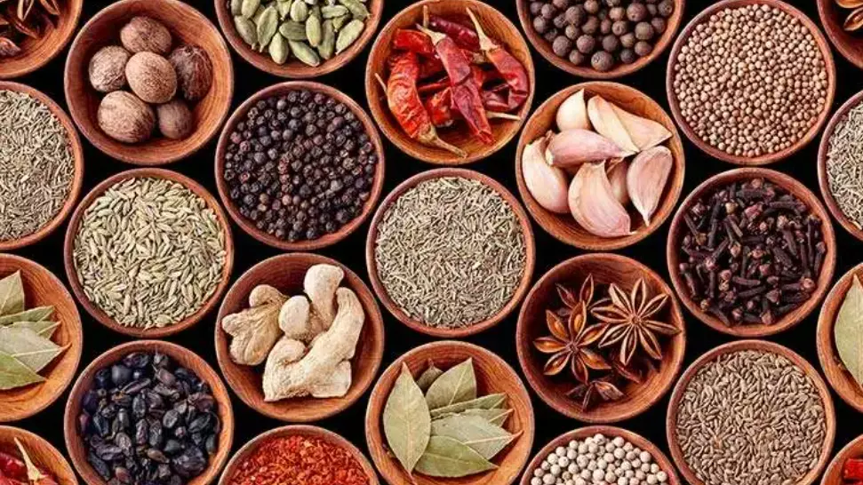

# 香料与调味品

> "Spices are the soul of cuisine, and they can transform simple ingredients into extraordinary dishes." —— 香料是料理的灵魂，它们能将简单的食材转化为非凡的菜肴。

香料和调味品是素食烹饪的关键，它们不仅增加风味，还能减少对盐和糖的依赖。掌握香料的使用方法，能让你的素食菜肴更加丰富多彩。

## 香料的基础知识

### 香料 vs 香草

**香料（Spices）：**
- 通常来自植物的**种子、根、树皮、果实**
- 干燥形式
- 例如：肉桂、小茴香、姜、胡椒

**香草（Herbs）：**
- 通常来自植物的**叶子**
- 可以是新鲜或干燥
- 例如：罗勒（九层塔）、香菜、薄荷

### 香料的作用

**1. 增加风味：**
- 提供各种味道（甜、辣、苦、香）
- 增加层次和复杂度

**2. 减少盐和糖：**
- 香料可以替代部分盐和糖
- 让食物更有味道

**3. 健康益处：**
- 许多香料有抗氧化、抗炎作用
- 例如：姜黄、肉桂、辣椒

:::tip

纯净素忌用“葱、蒜、韭、薤、兴渠”等五辛食材。中式素菜常见的大蒜、葱头等虽然能快速提升香气，但若需满足无五辛饮食，可改用姜片、白胡椒、香菜、香菇粉等来替代。

:::

## 基础香料组合

### 中式香料

| 香料 | 组成/特点 | 用途 | 备注 |
|:----:|:---------|:----|:----|
| **五香粉** | 小茴香、八角、桂皮、丁香、花椒 | 卤制、炖菜 | - |
| **十三香** | 多种香料组合 | 通用调味 | - |
| **花椒** | 麻味，独特的中式风味 | 川菜、麻辣菜肴 | - |
| **藤椒** | 新鲜青花椒晒干，香麻带柑橘香 | 藤椒油、蘸酱、凉拌菜 | 避免高温久炒，保留清香 |
| **干辣椒/辣椒粉** | 辣度分甜椒～朝天椒不等 | 炝锅、炒菜、火锅底、辣椒面蘸料 | 先用中火油炸至深红提香；粉状易糊要小火 |
| **八角** | 甜香味 | 卤制、炖菜 | - |

### 印度香料

| 香料 | 特点 | 用途 | 备注 |
|:----:|:----|:----|:----|
| **咖喱粉** | 多种香料混合 | 咖喱、炖菜 | - |
| **小茴香** | 温暖、泥土味 | 印度、中东料理 | - |
| **香菜籽** | 温和、柑橘味 | 印度、中东料理 | - |
| **姜黄** | 黄色、微苦 | 咖喱、增加颜色 | **健康益处：** 抗炎作用 |

### 地中海香料

| 香料 | 特点 | 用途 | 备注 |
|:----:|:----|:----|:----|
| **牛至** | 强烈、微苦 | 意大利料理、披萨 | - |
| **百里香** | 温和、木质味 | 汤、炖菜 | - |
| **迷迭香** | 强烈、松香味 | 烤制、炖菜 | - |

### 其他重要香料

| 香料 | 特点 | 用途 | 备注 |
|:----:|:----|:----|:----|
| **肉桂** | 甜、温暖 | 甜品、某些咸菜 | **健康益处：** 可能有助于血糖控制 |
| **辣椒粉/辣椒片** | 辣味、颜色鲜艳 | 增加辣味、撒在汤面或烘烤蔬菜上 | 根据品种选择辣度；烤后能带烟熏味 |
| **胡椒（黑胡椒/白胡椒）** | 黑胡椒辛辣带柑橘香；白胡椒更温和、带发酵味 | 通用调味、烤蔬菜、奶油汤 | 现磨香气最佳；白胡椒常用于中式羹汤 |
| **大蒜（五辛之一）** | 刺激香气、辛甜 | 炝锅、酱料、烤蔬菜 | 对纯净素、戒五辛者需标注或换葱姜组合 |
| **小豆蔻** | 强烈、甜香味 | 印度料理、某些甜品 | - |

### 东南亚香料

| 香料 | 特点 | 用途 | 备注 |
|:----:|:----|:----|:----|
| **柠檬叶（卡菲尔酸橙叶）** | 清新的柑橘芳香，叶片厚实 | 泰式咖喱、冬阴功汤、椰奶炖菜 | 食用前揉破或切丝释放香气，烹饪末段加入 |
| **香茅** | 柑橘与生姜混合的清香 | 泰式、越式汤品与咖喱，冷泡茶 | 用刀拍裂纤维或切段炖煮，避免咬到粗纤维 |
| **南姜（Galangal）** | 辛香带柑橘调 | 冬阴功、椰奶汤 | 与生姜不同，辣感较弱但香气更突出 |

## 常用调味品

### 1. 盐（Salt）

**类型：**
- **海盐**：天然，矿物质丰富
- **岩盐**：来自盐矿
- **精制盐**：最常见，加碘

**使用建议：**
- 适量使用
- 可以最后加入（保持蔬菜脆嫩）
- 某些香料可以减少盐的需求

### 2. 糖（Sugar）

**类型：**
- **白砂糖**：精制
- **红糖**：部分精制，有焦糖味
- **椰糖**：天然，有焦糖味
- **枫糖浆**：液体，有特殊风味
- **龙舌兰糖浆**：液体，甜味温和

**使用建议：**
- 适量使用
- 天然甜味剂（如水果）可以代替部分糖
- 某些香料（如肉桂）可以增加"甜感"

### 3. 酸味（Acid）

**柠檬汁：**
- 新鲜、明亮
- 用途：调味、防止氧化

**醋：**
- **米醋**：温和
- **苹果醋**：有果香
- **白醋**：强烈

**用途：**
- 平衡其他味道
- 最后加入（避免挥发）

### 4. 鲜味（Umami）

**酱油（Soy Sauce）：**
- 由大豆与小麦发酵而成，是中式烹饪最常见的鲜味来源。
- **类型：** 生抽（淡色、咸度高、适合调味）、老抽（颜色深、用于上色）、溏酱油/味极鲜（鲜味浓郁）。
- 多数酱油是纯植物性，但部分品牌可能加入鸡汁、鱼露或肉骨精调味；素食者需要阅读配料表，选择“纯酿造”、“无动物成分”产品。

**耗油与素耗油：**
- 传统耗油以牡蛎提炼，包含动物成分，不符合纯素饮食。
- **素耗油**（例如香菇素耗油、猴头菇酱、昆布鲜露）以香菇/蘑菇、海藻、酱油为基底，浓缩鲜味，可用于炒青菜、拌面、炖菜。
- 购买时留意标签：选择标明“纯素”“Vegan”或“植物配方”的产品，避免含有蚝、鱼、贝类抽提物。

**味精（MSG，谷氨酸钠）：**
- 现代工业味精多以淀粉、甘蔗糖蜜或甜菜发酵制成，为纯植物来源，属于合法调味剂。
- 能放大鲜味、减少1/3左右的盐用量；少量使用即可，不建议在未煮熟的酸菜、泡菜中直接添加。
- 若对味精敏感，可改用昆布粉、蘑菇粉或营养酵母。

**味噌：**
- 发酵鲜味，含益生菌；根据颜色分白味噌、黄味噌、赤味噌。
- 不要煮沸（会破坏营养和风味），关火后溶入汤汁或酱料。

**营养酵母：**
- 带有 "奶酪" 和 "坚果" 风味，是常见的植物蛋白调味粉。
- 可以撒在意面、烤蔬菜或加入酱料，亦可与腰果打成素芝士酱。

**豆豉（Fermented Black Beans）：**
- 以黑豆或黄豆发酵制成，带烟熏、酱香与微苦甘味，是粤菜、川菜常用调味料。
- 使用时冲洗去多余盐分，切碎后与蒜、姜一同爆香，可用于炒菜、蒸菜、酱汁。
- 购买留意“豆豉辣酱”常含虾米、牛油等动物成分，纯素者选择原味豆豉或标明“素豆豉”的品牌。

**豆瓣酱：**
- 通过蚕豆（或黄豆）、辣椒、面粉发酵而成，口味浓郁，是川菜灵魂调味料。
- 郫县豆瓣多为纯素，但部分商业辣椒酱可能混入牛油、猪油以增香，购买时注意配料表。

**腐乳（发酵豆腐）：**
- 又称“豆腐乳”，由豆腐经霉菌培养、盐渍、发酵而成，分红、白、青多种类型。
- 风味咸鲜、带微酒香，可调拌蔬菜、煮粥、制作蘸酱或作为素肉腌料。
- 许多传统配方会加入虾酱、鱼露或动物性酒糟，纯素者可选择标明“素腐乳”“全植物配方”的品牌，或自制豆乳发酵。

## 香料的使用技巧

#### 1. 干香料 vs 新鲜香料

**干香料：**
- 更强烈、更持久
- 适合长时间烹饪
- **技巧：** 可以先用油爆香，释放香气

**新鲜香料：**
- 更温和、更明亮
- 适合最后加入
- **技巧：** 不要过度烹饪

#### 2. 整粒 vs 磨碎

**整粒：**
- 更持久，但需要时间释放
- 适合长时间炖煮

**磨碎：**
- 立即释放，但容易失去
- 适合快速烹饪

#### 3. 爆香技巧

**原理：** 热油能释放香料的香气

**方法：**
1. 热锅热油
2. 加入香料（整粒或磨碎）
3. 快速翻炒30秒-1分钟
4. 注意不要烧焦

**适用：** 小茴香、花椒、八角、肉桂等

#### 4. 香料组合

**经典组合：**
- **印度风：** 小茴香 + 香菜籽 + 姜黄 + 辣椒
- **地中海风：** 牛至 + 百里香 + 迷迭香
- **中式：** 八角 + 桂皮 + 花椒 + 小茴香
- **墨西哥风：** 小茴香 + 辣椒 + 香菜

## 素食新手调味小贴士

1. **打造基础香味油：** 取植物油，小火爆香大蒜或姜片，加入干辣椒/藤椒，过滤后即成香油，能瞬间提升炒青菜、凉拌菜风味。
2. **快速浓郁汤底：** 在蔬菜汤中加入胡椒粉、月桂叶与味噌，再配柠檬汁提鲜，可替代肉骨汤的厚重感。
3. **无五辛方案：** 以香菇粉 + 白胡椒 + 芝麻油替代蒜头，适合宴客时区分不同饮食需求。
4. **泰式风味捷径：** 柠檬叶 + 香茅 + 辣椒 + 椰奶即可营造冬阴功或泰式咖喱的香气层次。
5. **自制撒粉：** 辣椒粉与孜然粉 1:1 混合，再加盐和黑胡椒，可撒在烤南瓜、烤花椰菜或素烤串上。

## 常见问题

#### 1. 香料太多怎么办？

**答案：**
- 从少量开始，逐步增加（记住：可以加，但不能减）
- 下次记得少加点（总要经历失败才能长经验嘛）

#### 2. 香料不香怎么办？

**答案：**
- 检查是否过期
- 尝试爆香
- 考虑购买新的

#### 3. 如何减少盐和糖？

**答案：**
- 使用香料增加风味
- 使用酸味平衡
- 使用鲜味来源

## 厨房小结

香料和调味品是素食烹饪的关键。通过理解它们的特性，掌握使用技巧，你就能创造出丰富多彩的素食菜肴。

> 🌶️ "Spices are the bridge between simple ingredients and extraordinary flavors."
>
> 香料是简单食材和非凡风味之间的桥梁。

记住：**从少量开始，逐步增加**，多尝试、多实验，你一定能找到最适合的香料组合！
